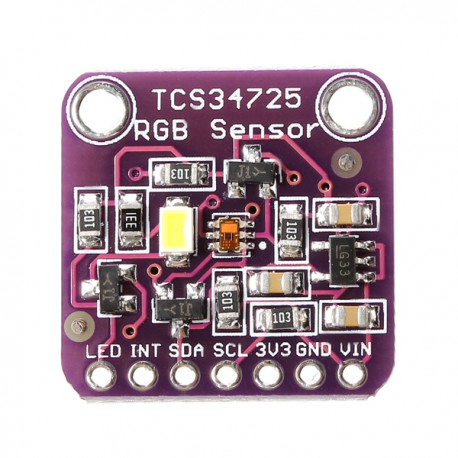
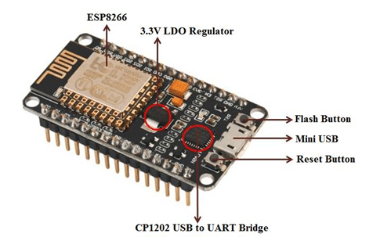

# TCS34725
Código para probar el sensor de colores TCS34725 con Micro Python

Este es el sensor de color TCS34725 el cual es probado con codigo Micropython y microcontrolador esp-8266.

para poder hacer funcionar el esp-8266 con el TCS34725 tuve que hacer unos cambios en el firmware y usar el de Adafruit(&trade;)

que descargue aqui https://github.com/adafruit/circuitpython/releases/download/3.1.2/adafruit-circuitpython-feather_huzzah-3.1.2.bin 

Es una version en desuso pero para hacer la prueba funciono.

En este punto es importante indicar que para instalar el firmware use esptools, si no esta familiarizado hay otros tutoriales con la documentacion de uso y para instalarlo, borre la memoria flash del esp-8266 e instale el firmware.

Una vez instalado el firmware entonces se requiere de ampy, herramienta de Micropython (de Adafruit(&trade;) tambien) que es el interface para poner los archivos de python en el board esp-8266. Para principiantes una busqueda en Google de estos terminos les mostrara toneladas de informacion, no tiene caso desglosarlos aqui.

Tomado de esta fuente en ingles https://learn.adafruit.com/welcome-to-circuitpython/circuitpython-for-esp8266

Aqui viene lo que podria dar problemas, ya que no estamos usando un firmware normal de esp-8266 tenemos que copiar algunos archivos que van a simular el board en el esp8266.

Tomado de esta fuente en ingles https://learn.adafruit.com/adafruit-color-sensors/python-circuitpython

1-'adafruit_tcs34725.mpy' copiar codigo de aqui: https://github.com/adafruit/Adafruit_CircuitPython_TCS34725
2-'adafruit_bus_device' copiar solo i2c_device.py que es el que vamos a usar: https://github.com/adafruit/Adafruit_CircuitPython_BusDevice/tree/master/adafruit_bus_device

Estos dos drivers son indispensables para poder hacer la prueba.

Hay que pasarlos al esp-8266 con ampy de la siguiente manera:
(En Windows Power Shell)

ampy --port COM3 put adafruit_tcs34725.py

ampy --port COM3 put i2c_device.py
